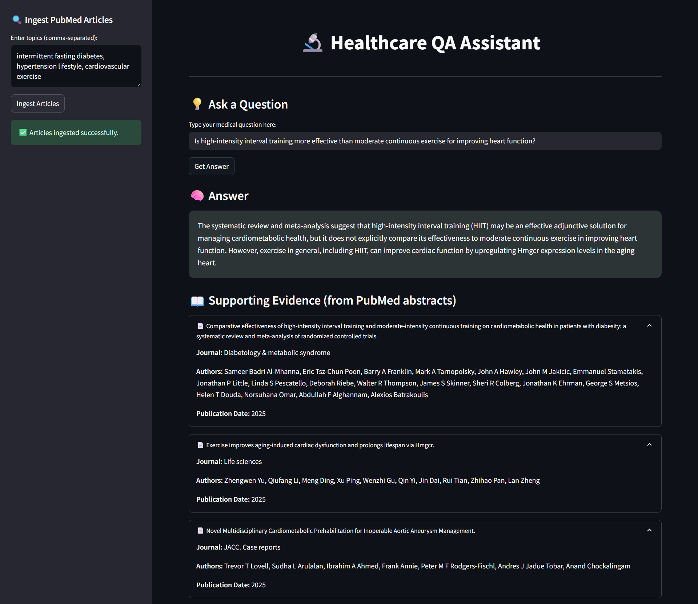

# 🔬 Healthcare QA Assistant

A user-friendly web application developed using Streamlit that enables evidence-based medical question answering. Users can enter medical topics (e.g., "intermittent fasting diabetes") and ask domain-specific questions. The system retrieves abstracts from PubMed, stores them in a vector database, and generates answers grounded in the actual scientific literature using RAG (Retrieval-Augmented Generation).

---

## 🌐 Live Website
You can try the tool live here: **[Healthcare QA Assistant](https://vaibhav-project-healthcare-app-assistant.streamlit.app/)**

---

<!-- ## 🎥 Presentation
Watch the full project presentation here: **[Real Estate Research Tool Presentation](https://vaibhav-projects.my.canva.site/real-estate-research-tool)**

--- -->

## 🛠 Features  
- Clean and interactive Streamlit-based web UI. 
- Ingests topics and fetches relevant PubMed articles.  
- Splits articles into chunks and stores them in ChromaDB for semantic retrieval.
- Generates concise, evidence-based answers using LLaMA3 via GROQ API.
- Provides supporting metadata (title, authors, journal, date) for transparency.  
- Modular and extendable to other domains beyond healthcare.  

---

## 📂 Project Structure

```
Healthcare_QA_Assistant//
│
├── chroma_db/              # Local ChromaDB persistent database
├── main.py                 # Streamlit frontend
├── ingestion.py            # Embeddings, chunking, and QA pipeline
├── pubmed.py               # PubMed API (Entrez) search + fetch utilities
├── LICENSE                 # Apache License file
├── README.md               # Project documentation
└── requirements.txt        # Dependencies
```

---

## 🚀 How to Run Locally 

### ⚠️ Note for Windows Users

This project uses **ChromaDB**, which requires **SQLite ≥ 3.35.0**. Most Linux environments (like Streamlit Cloud) are patched using `pysqlite3-binary`, but:

- **`pysqlite3-binary` does NOT install on Windows**.
- If you're on Windows and the app works, your system SQLite is likely already up-to-date.
- If you encounter a `sqlite3` version error, please [manually install SQLite ≥ 3.35.0](https://www.sqlite.org/download.html) and ensure it's on your system PATH.

> **Do not install `pysqlite3-binary` on Windows** — it's only meant for Linux deployments (e.g., Streamlit Cloud).

### Prerequisites:  
- Python 3.8+

1. **Clone the repository**:
   ```bash
   git clone https://github.com/vaibhavgarg2004/Healthcare-QA-Assistant.git
   cd Healthcare-QA-Assistant
   ```
2. **Install dependencies**:   
   ```commandline
    pip install -r requirements.txt
   ```
3. **Add GROQ credentials in a .env file**:
    ```text
    GROQ_API_KEY=GROQ_API_KEY_HERE
    GROQ_MODEL=llama-3.3-70b-versatile
   ```
5. **Run the Streamlit app**:   
   ```commandline
    streamlit run main.py
   ```

---

## 🧠 How It Works

1. **Article Retrieval**  
   - Users provide medical topics in the sidebar (comma-separated).  
   - The app queries **PubMed (Entrez API)** to fetch article abstracts and metadata.  

2. **Processing & Storage**  
   - Articles are split into smaller chunks.  
   - Chunks are embedded with **SentenceTransformers (MiniLM)**.  
   - Stored in **ChromaDB** for efficient semantic search.  

3. **Question Answering**  
   - Users submit questions in natural language.  
   - Relevant chunks are retrieved from **ChromaDB**.  
   - **LLaMA3 (via GROQ)** generates concise, evidence-grounded answers.  

4. **Transparency**  
   - Metadata such as **authors, journal, and publication date** is displayed alongside each generated answer.

---
   
## 🖼️ Application Snapshot



---

## 📄 License
This project is licensed under the **Apache License 2.0**. See the [LICENSE](./LICENSE) file for details.

---

*Your AI healthcare assistant — retrieving PubMed evidence and generating trustworthy answers.*

